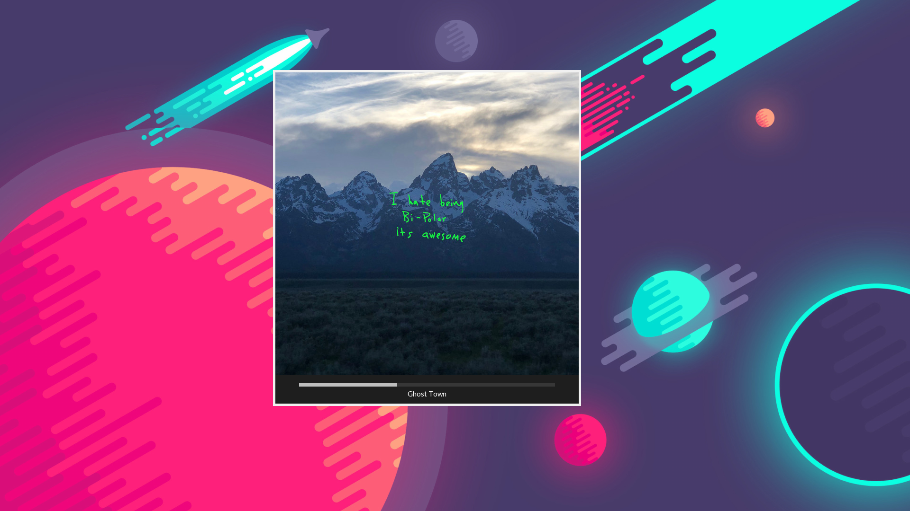
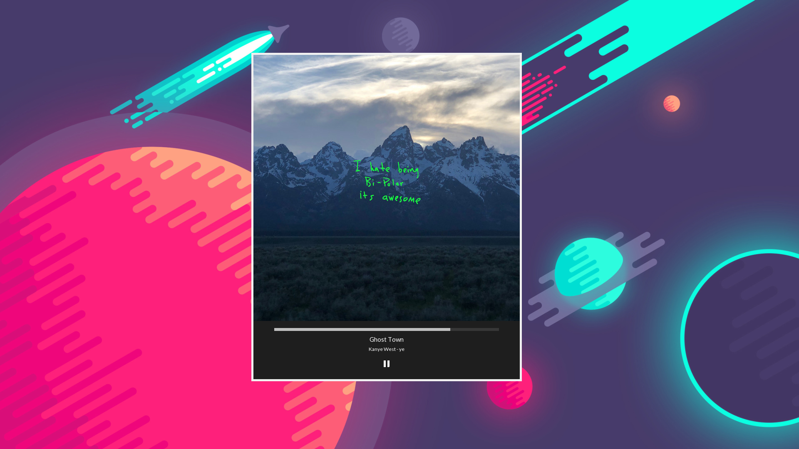

# albumify
An extremely simple app that displays Spotify's current song's album cover, title, and progress




After switching to Spotify, i noticed they don't have a way to only see the album cover like Itunes. This runs along side Spotify and shows all that stuff.

## Installation

```
git clone https://github.com/IbrahimFadel/albumify
cd albumify
```

Go to the [Spotify Developer Console](https://developer.spotify.com/console/) and get credentials.

Copy ```config.def.h``` to ```config.h``` and put your spotify credentials in.


```
sudo make install
```

## Usage

While a spotify song is playing, just run

```
albumify
```

This will open up the window
